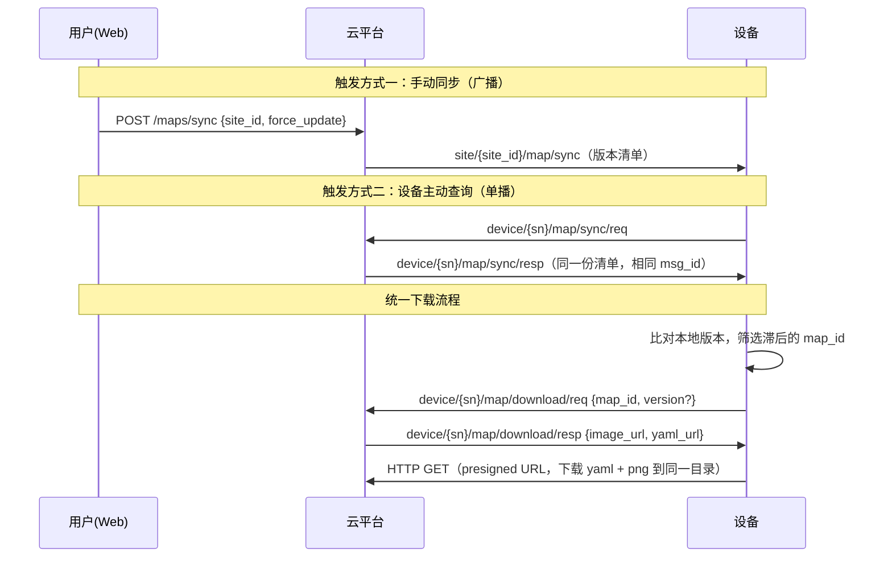

# 导航相关

## 地图

地图分发采用「清单同步 + 按需下载」模式：

- **同步（sync）**：平台向设备投递站点地图版本清单（不含文件），设备比对本地版本
- **下载（download）**：设备对滞后的地图发起下载请求，平台返回 presigned URL，
  设备通过 HTTP 拉取地图文件（**下载是唯一的文件同步路径**）



### 地图同步广播

- **协议类型**: MQTT
- **接口地址**: `site/:site_id/map/sync`
- **接口方向**: 平台 -> 设备（站点广播）
- **触发方式**: 管理端调用 `POST /maps/sync`（站点级，一次覆盖该站点全部地图）
- **请求参数**

  ```json
  {
    "msg_id": "uuid-789",
    "timestamp": 1757403776000, // Unix 时间戳（毫秒）
    "data": {
      // 站点内所有地图的当前版本清单
      // 设备本地无此 map_id、或版本号不一致，都需要下载更新
      "versions": [
        { "map_id": "uuid-map-id-1", "version": 3 },
        { "map_id": "uuid-map-id-2", "version": 1 }
      ],
      // 默认 false
      // 在地图改动影响当前设备运行时为 true，表示强制停止运行，立即更新
      "force_update": false
    }
  }
  ```

### 地图同步查询（设备主动对齐）

设备可在任意时机（建议上线/重连后）主动查询所属站点的地图版本清单，
不依赖可能错过的广播。

- **协议类型**: MQTT
- **接口地址**: `device/:serial_number/map/sync/req`
- **接口方向**: 设备 -> 平台
- **请求参数**: 无 data

  ```json
  {
    "msg_id": "uuid-100",
    "timestamp": 1757403776000,
    "serial_number": "RDU2511TR500A0832"
  }
  ```

### 地图同步查询响应

响应投递到设备自身 topic，payload 结构与广播**完全一致**。

- **协议类型**: MQTT
- **接口地址**: `device/:serial_number/map/sync/resp`
- **接口方向**: 平台 -> 设备（单播）
- **响应参数**: 同「地图同步广播」，其中 `force_update` 恒为 `false`

**广播与查询响应的区分**（同一 payload 结构，两个来源）：

| 维度 | 广播 | 查询响应 |
| ---- | ---- | ---- |
| 到达 topic | `site/{site_id}/map/sync` | `device/{sn}/map/sync/resp` |
| msg_id | 新消息 ID | 复用设备请求的 msg_id，可精确配对 |
| force_update | 可能为 true | 恒为 false |

设备应按到达 topic 分流行为：广播且 `force_update=true` 时需立即中断任务更新；
查询响应用于静默对齐，不应触发强制行为。

### 地图下载请求

设备比对清单后，对每个滞后的 map_id 分别发起下载请求。

- **协议类型**: MQTT
- **接口地址**: `device/:serial_number/map/download/req`
- **接口方向**: 设备 -> 平台
- **请求参数**

  ```json
  {
    "msg_id": "uuid-200",
    "timestamp": 1757403776000,
    "serial_number": "RDU2511TR500A0832",
    "data": {
      "map_id": "uuid-map-id",
      "version": 3 // 可选，缺省表示下载当前最新版本
    }
  }
  ```

### 地图下载响应

- **协议类型**: MQTT
- **接口地址**: `device/:serial_number/map/download/resp`
- **接口方向**: 平台 -> 设备
- **响应参数**

  ```json
  {
    "msg_id": "uuid-200", // 复用请求的 msg_id
    "timestamp": 1757403776000,
    "serial_number": "RDU2511TR500A0832",
    "data": {
      "map_id": "uuid-map-id",
      "version": 3, // 实际准备的版本（req 缺省时为当前最新版本）
      "image_url": "http://minio/.../xxx.png?X-Amz-Signature=...", // presigned URL
      "yaml_url": "http://minio/.../xxx.yaml?X-Amz-Signature=...", // presigned URL
      "expire_at": 1757407376 // URL 过期时间，Unix 时间戳（秒）
    }
  }
  ```

### 地图文件说明

设备需在 `expire_at` 前通过 HTTP GET 下载 **两个文件** 并保存到**同一目录**：

| 文件 | 说明 |
| ---- | ---- |
| `{name}.png` | 栅格地图图片 |
| `{name}.yaml` | ROS map_server 标准元数据文件，与图片同 basename |

yaml 内容示例（阈值参数为 ROS 标准默认值）：

```yaml
image: xxx.png           # 相对路径，yaml 与图片须放同一目录
resolution: 0.05
origin: [-10.5, 3.25, 1.5708]
negate: 0
occupied_thresh: 0.65
free_thresh: 0.196
mode: trinary
```

**文件校验**：图片/yaml 的校验值（ETag）由设备从 HTTP 响应头中获取，无需平台在消息中传递。
同一 (map_id, version) 的文件内容不变、ETag 稳定，设备可据此避免重复下载。

**清单外地图处理**：设备本地存在、但同步清单中不包含的地图（如云端已删除），
由设备端策略处理（建议清理）。
