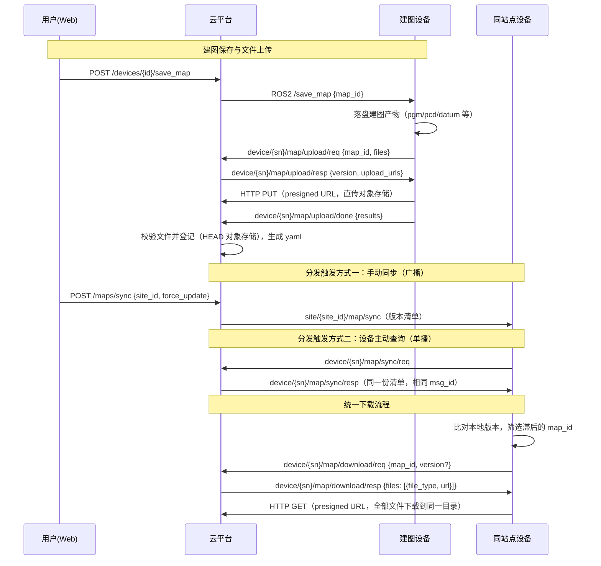

# 导航相关

## 地图

地图文件流转采用「MQTT 协商 + presigned URL + HTTP 传输」模式，分上行与下行：

- **上传（upload）**：建图设备在平台保存地图后，将建图产物（pgm/pcd/datum/info 等）
  直传对象存储；png 预览图在建图期间已通过 ROS2 topic 上报，不在本流程内
- **同步（sync）**：平台向设备投递站点地图版本清单（不含文件），设备比对本地版本
- **下载（download）**：设备对滞后的地图发起下载请求，平台返回各文件的 presigned URL，
  设备通过 HTTP 拉取地图文件（**下载是唯一的文件分发路径**）

版本语义：版本号为 **map bundle 修订号**——任何配套文件变更（重新建图、
云端编辑 png、编辑/删除路网 route_graph）都会使版本号 +1；未变化的文件新版本
直接复用，不重复上传（存储去重），设备按 md5 比对跳过下载（下载去重）。
route_graph 的格式与编辑 API 见 [route.md](./route.md)。

云端编辑 png 经 `PUT /v1/maps/{id}/image` 保存（请求体为 png 二进制，宽高须与
地图元数据一致）：仅替换预览图（pgm 等未变文件平移引用），版本 +1 后设备按
md5 差异重下 png。



### 地图上传请求

设备收到 `/save_map` 调用并完成本地产物落盘后，声明待上传的文件类型与文件名，
请求上传地址。设备无需知晓平台侧版本号，由平台在响应中告知。

- **协议类型**: MQTT
- **接口地址**: `device/:serial_number/map/upload/req`
- **接口方向**: 设备 -> 平台
- **请求参数**

  ```json
  {
    "msg_id": "uuid-300",
    "timestamp": 1757403776000,
    "serial_number": "RDU2511TR500A0832",
    "data": {
      "map_id": "uuid-map-id",
      "files": [
        { "file_type": "pgm", "filename": "map.pgm" },
        { "file_type": "pcd", "filename": "scan.pcd.gz" },
        { "file_type": "datum" }
      ]
    }
  }
  ```

  - `files`：待上传的文件类型与文件名清单
    - `file_type`：文件类型，见文末「地图文件说明」
    - `filename`：设备本地文件名（可选）。提供则使用设备文件名，缺省则由平台生成 `{version_id}.{ext}`
  - 设备按自身能力声明：无点云定位能力的设备可不声明 `pcd`；
    仅 `align_wgs84=true` 建图产生 `datum`；`info` 为设备端特有文件，按需声明；
    `route_graph` 由平台编辑，不在声明范围内

### 地图上传响应

- **协议类型**: MQTT
- **接口地址**: `device/:serial_number/map/upload/resp`
- **接口方向**: 平台 -> 设备（单播）
- **响应参数**

  ```json
  {
    "msg_id": "uuid-300",
    "timestamp": 1757403776000,
    "serial_number": "RDU2511TR500A0832",
    "data": {
      "map_id": "uuid-map-id",
      "version": 3,
      "files": [
        {
          "file_type": "pgm",
          "filename": "map.pgm",
          "upload_url": "http://minio/.../map.pgm?X-Amz-Signature=..."
        },
        {
          "file_type": "pcd",
          "filename": "scan.pcd.gz",
          "upload_url": "http://minio/.../scan.pcd.gz?X-Amz-Signature=..."
        },
        {
          "file_type": "datum",
          "filename": "xxx.datum.yaml",
          "upload_url": "http://minio/.../xxx.datum.yaml?X-Amz-Signature=..."
        }
      ],
      "expire_at": 1757407376
    }
  }
  ```

设备须在 `expire_at` 前对每个文件执行 HTTP PUT 上传（请求体为文件原始字节，
pcd 为 gzip 压缩后字节）。上传失败或 URL 过期的文件，重新发起 upload/req 获取新地址。

### 地图上传完成通知

全部文件上传结束后（含部分失败），设备通知平台收尾校验。

- **协议类型**: MQTT
- **接口地址**: `device/:serial_number/map/upload/done`
- **接口方向**: 设备 -> 平台
- **请求参数**

  ```json
  {
    "msg_id": "uuid-301",
    "timestamp": 1757403776000,
    "serial_number": "RDU2511TR500A0832",
    "data": {
      "map_id": "uuid-map-id",
      "version": 3,
      "results": [
        { "file_type": "pgm", "filename": "map.pgm", "success": true },
        {
          "file_type": "pcd",
          "filename": "scan.pcd.gz",
          "success": false,
          "message": "连接中断，稍后重试"
        }
      ]
    }
  }
  ```

平台逐文件校验（HEAD 对象存储确认文件就绪），以实际 size/ETag 登记文件清单。
全部上传成功后生成 yaml 并登记。存在失败或缺失文件的版本不生成 yaml
（平台侧告警）；设备重传完成后再次发送本通知（done 始终为全量结果）。

站点同步不在本流程触发：由管理端调用 `POST /maps/sync` 手动广播
（见「地图同步广播」）。

### 地图同步广播

- **协议类型**: MQTT
- **接口地址**: `site/:site_id/map/sync`
- **接口方向**: 平台 -> 设备（站点广播）
- **触发方式**: 管理端调用 `POST /maps/sync`（站点级，一次覆盖该站点全部地图）
- **请求参数**

  ```json
  {
    "msg_id": "uuid-789",
    "timestamp": 1757403776000, // Unix 时间戳（毫秒）
    "data": {
      // 站点内所有地图的当前版本清单
      // 设备本地无此 map_id、或版本号不一致，都需要下载更新
      "versions": [
        { "map_id": "uuid-map-id-1", "version": 3 },
        { "map_id": "uuid-map-id-2", "version": 1 }
      ],
      // 默认 false
      // true 表示强制全量重新下载：忽略本地 md5 比对，拉取版本全部文件并覆盖本地
      // （用于本地文件损坏、md5 列表失常等异常修复，不含任何任务调度语义）
      "force_update": false
    }
  }
  ```

### 地图同步查询（设备主动对齐）

设备可在任意时机（建议上线/重连后）主动查询所属站点的地图版本清单，
不依赖可能错过的广播。

- **协议类型**: MQTT
- **接口地址**: `device/:serial_number/map/sync/req`
- **接口方向**: 设备 -> 平台
- **请求参数**: 无 data

  ```json
  {
    "msg_id": "uuid-100",
    "timestamp": 1757403776000,
    "serial_number": "RDU2511TR500A0832"
  }
  ```

### 地图同步查询响应

响应投递到设备自身 topic，payload 结构与广播**完全一致**。

- **协议类型**: MQTT
- **接口地址**: `device/:serial_number/map/sync/resp`
- **接口方向**: 平台 -> 设备（单播）
- **响应参数**: 同「地图同步广播」，其中 `force_update` 恒为 `false`

**广播与查询响应的区分**（同一 payload 结构，两个来源）：

| 维度         | 广播                      | 查询响应                          |
| ------------ | ------------------------- | --------------------------------- |
| 到达 topic   | `site/{site_id}/map/sync` | `device/{sn}/map/sync/resp`       |
| msg_id       | 新消息 ID                 | 复用设备请求的 msg_id，可精确配对 |
| force_update | 可能为 true               | 恒为 false                        |

设备应按到达 topic 分流行为：广播且 `force_update=true` 时忽略本地 md5 比对，
全量重新下载该设备相关的地图文件并覆盖本地；查询响应用于静默对齐，
`force_update` 恒为 false，按常规「版本比对 + 差异下载」处理。

### 地图删除

管理端调用 `DELETE /api/v1/maps/{id}` 删除地图（软删除）后，平台自动向站点广播
最新版本清单（`site/{site_id}/map/sync`，`force_update=false`），被删地图不再
出现在清单中。设备按文末「清单外地图处理」策略清理本地副本；错过广播的设备
在下次主动查询清单时亦可对齐。

### 地图下载请求

设备比对清单后，对每个滞后的 map_id 分别发起下载请求。

- **协议类型**: MQTT
- **接口地址**: `device/:serial_number/map/download/req`
- **接口方向**: 设备 -> 平台
- **请求参数**

  ```json
  {
    "msg_id": "uuid-200",
    "timestamp": 1757403776000,
    "serial_number": "RDU2511TR500A0832",
    "data": {
      "map_id": "uuid-map-id",
      "version": 3 // 可选，缺省表示下载当前最新版本
    }
  }
  ```

### 地图下载响应

- **协议类型**: MQTT
- **接口地址**: `device/:serial_number/map/download/resp`
- **接口方向**: 平台 -> 设备
- **响应参数**

  ```json
  {
    "msg_id": "uuid-200", // 复用请求的 msg_id
    "timestamp": 1757403776000,
    "serial_number": "RDU2511TR500A0832",
    "data": {
      "map_id": "uuid-map-id",
      "version": 3, // 实际准备的版本（req 缺省时为当前最新版本）
      "files": [
        {
          "file_type": "yaml",
          "filename": "map.yaml",
          "url": "http://minio/...?X-Amz-Signature=...",
          "size": 128,
          "md5": "d41d8cd9..."
        },
        {
          "file_type": "pgm",
          "filename": "map.pgm",
          "url": "http://minio/...",
          "size": 1048576,
          "md5": "..."
        },
        {
          "file_type": "png",
          "filename": "map.png",
          "url": "http://minio/...",
          "size": 102400,
          "md5": "..."
        },
        {
          "file_type": "pcd",
          "filename": "scan.pcd.gz",
          "url": "http://minio/...",
          "size": 52428800,
          "md5": "..."
        },
        {
          "file_type": "datum",
          "filename": "map.datum.yaml",
          "url": "http://minio/...",
          "size": 96,
          "md5": "..."
        },
        {
          "file_type": "info",
          "filename": "map_info.json",
          "url": "http://minio/...",
          "size": 512,
          "md5": "..."
        },
        {
          "file_type": "route_graph",
          "filename": "route_graph.geojson",
          "url": "http://minio/...",
          "size": 8192,
          "md5": "..."
        }
      ],
      "expire_at": 1757407376 // URL 过期时间，Unix 时间戳（秒）
    }
  }
  ```

`files` 按该版本**实际已就绪**的文件返回。地图保存后设备文件异步补齐
（见「地图上传」），下载设备发现必需文件缺失时，应延迟后重新发起
download/req（建议指数退避）。

### 地图文件说明

设备需在 `expire_at` 前通过 HTTP GET 下载 files 列表中的**全部文件**并保存到**同一目录**：

| 文件                             | file_type     | 来源                                       | 用意                                                                                           | 必需性              |
| -------------------------------- | ------------- | ------------------------------------------ | ---------------------------------------------------------------------------------------------- | ------------------- |
| `{filename}.pgm`                 | `pgm`         | 设备上传                                   | ROS map_server 栅格地图；地图编辑的源文件                                                      | 必需                |
| `{filename}.yaml`                | `yaml`        | 设备上传                                   | ROS map_server 标准元数据文件，与 pgm 同 basename                                              | 必需                |
| `{filename}.png`                 | `png`         | 平台保存（建图期间设备经 ROS2 topic 上报） | Web 展示预览                                                                                   | 必需                |
| `{filename}.pcd.gz`               | `pcd`         | 设备上传                                   | 三维点云（gzip 压缩），设备端定位；下载后解压为 `{filename}.pcd`                                | 视设备能力          |
| `{filename}.datum.yaml`          | `datum`       | 设备上传                                   | WGS84 与 local map 原点的对应关系，格式见 [navigation.md](../ros_msgs/navigation.md#datum-yaml) | 仅 align_wgs84 建图 |
| `{filename}.map_info.json`       | `info`        | 设备上传                                   | 设备端特有的地图补充信息（内容由设备自定义），随版本透传给同站点其他设备                        | 视设备能力          |
| `route_graph.geojson`            | `route_graph` | 云端编辑                                   | 路网（节点/边/区域），格式见 [route.md](./route.md)                                            | 可选                |

**文件命名**：
- 文件名由设备上传时决定，响应中 `files[].filename` 即实际存储/下载使用的文件名
- 若设备未提供 `filename`，平台生成固定格式：`{version_id}.{ext}`（如 `01234567-89ab-cdef-0123-456789abcdef.pgm`）
- `route_graph` 特殊处理：文件名固定为 `route_graph.geojson`

**存储路径**：`tenants/{tenant_id}/maps/{version_id}/{filename}`
- 不同版本通过 `{version_id}` 子目录隔离，避免文件覆盖

yaml 内容示例（阈值参数为 ROS 标准默认值）：

```yaml
image: map.pgm  # 相对路径，yaml 与地图文件须放同一目录（文件名与上传的 pgm 一致）
resolution: 0.05
origin: [-10.5, 3.25, 1.5708]
negate: 0
occupied_thresh: 0.65
free_thresh: 0.196
mode: trinary
```

设备上传 yaml 时，`image` 字段必须与同版本上传的 pgm/png 文件名一致。

datum.yaml 的格式定义与示例见 [navigation.md](../ros_msgs/navigation.md#datum-yaml)，
仅 `align_wgs84=true` 建图的地图包含此文件。

**文件校验**：响应中携带各文件的 `size` 与 `md5`（hex）。设备先与本地文件比对 md5，
一致的文件跳过下载（如路网编辑后仅需重下 geojson 文件，未变化的 pcd 可跳过）；
下载完成后再用 md5 校验内容完整性。同一 (map_id, version) 的文件内容不变、md5 稳定
（任何文件变更都会产生新版本号）。

**清单外地图处理**：设备本地存在、但同步清单中不包含的地图（如云端已删除），
由设备端策略处理（建议清理）。
