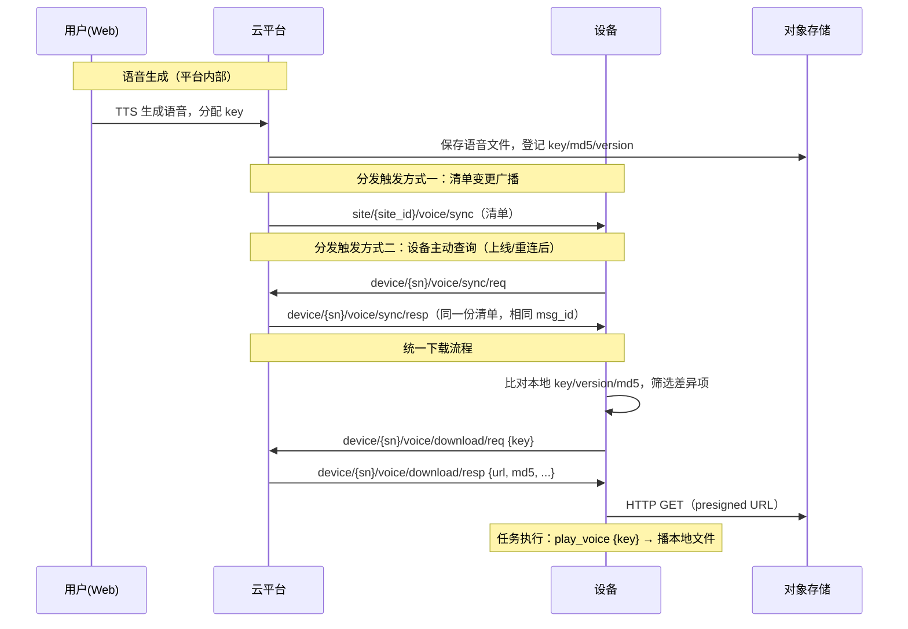

# 语音播报相关

语音播报功能当前包含三部分能力：

- **语音文件生成**：平台侧通过 TTS 根据文字生成语音文件，分配语音 key
- **语音文件分发**：语音文件经「清单同步 + 下载」模式分发到设备本地
- **任务中播放**：任务 waypoint 的 actions 中通过 `play_voice` 动作引用语音 key（见 [mission.md](./mission.md)）

> 设备在特定场景下的自主播报（如被阻挡提醒）当前由**设备端自行实现**
> （场景检测与播放映射均为设备本地逻辑，不依赖平台下发配置）。
> 平台统一下发场景绑定的方案见文末「演进方向」。

## 共识机制

设备与平台对**语音 key** 达成共识：

- **语音 key**：语音文件的语义化标识，租户内唯一，snake_case（如 `warn_obstacle_01`）。
  创建语音时指定（必填，保证语义化），设备按 key 索引本地文件
- 任务 waypoint 的 `play_voice` 动作通过 key 引用语音文件，
  设备执行动作时按 key 播放本地文件
- 设备无需预置任何 key——设备只认平台下发的语音清单

## 文件分发模式

语音文件流转采用与地图一致的三段式模式（见 [map.md](./map.md) 开头说明）：

- **同步（sync）**：平台向站点投递语音清单（不含文件），设备比对本地版本
- **下载（download）**：设备对缺失/滞后的 key 发起下载请求，平台返回 presigned URL，
  设备通过 HTTP 拉取文件（**下载是唯一的文件分发路径**）

与地图的差异：语音为单文件资源（无 bundle），清单项直接以 key 标识。



## 语音同步广播

平台在语音清单变更时（语音生成/删除）向站点广播最新清单；
也可由管理端调用 `POST /voices/sync` 手动触发。

- **协议类型**: MQTT
- **接口地址**: `site/:site_id/voice/sync`
- **接口方向**: 平台 -> 设备（站点广播）
- **请求参数**

  ```json
  {
    "msg_id": "uuid-789",
    "timestamp": 1757403776000, // Unix 时间戳（毫秒）
    "data": {
      // 文件类别，预留字段，当前恒为 voice
      // （为后续其他轻量文件同步复用本模式预留）
      "category": "voice",
      // 站点内设备应有的全部语音文件清单
      // 设备本地无此 key、或 version/md5 不一致，都需要下载更新
      "files": [
        {
          "key": "warn_obstacle_01", // 语音 key，租户内唯一
          "version": 2, // 文件版本，内容变更 +1
          "md5": "d41d8cd9...", // 文件内容 md5（hex），去重与完整性校验
          "size": 40960, // 字节数
          "mime_type": "audio/mpeg", // 音频格式，设备按解码能力处理
          "duration_ms": 3200 // 播放时长（毫秒），可选
        }
      ],
      // 默认 false；true 表示强制全量重新下载（忽略本地 md5 比对），
      // 用于本地文件损坏等异常修复，语义同 map sync
      "force_update": false
    }
  }
  ```

## 语音同步查询（设备主动对齐）

设备可在任意时机（**建议上线/重连后**）主动查询所属站点的语音清单，
不依赖可能错过的广播。

- **协议类型**: MQTT
- **接口地址**: `device/:serial_number/voice/sync/req`
- **接口方向**: 设备 -> 平台
- **请求参数**: 无 data

  ```json
  {
    "msg_id": "uuid-100",
    "timestamp": 1757403776000,
    "serial_number": "RDU2511TR500A0832"
  }
  ```

## 语音同步查询响应

- **协议类型**: MQTT
- **接口地址**: `device/:serial_number/voice/sync/resp`
- **接口方向**: 平台 -> 设备（单播）
- **响应参数**: 同「语音同步广播」，其中 `force_update` 恒为 `false`

广播与查询响应的区分规则与地图一致：按到达 topic 分流，
广播且 `force_update=true` 时全量覆盖本地；查询响应用于静默对齐。

## 语音下载请求

设备比对清单后，对每个缺失/滞后的 key 分别发起下载请求。

- **协议类型**: MQTT
- **接口地址**: `device/:serial_number/voice/download/req`
- **接口方向**: 设备 -> 平台
- **请求参数**

  ```json
  {
    "msg_id": "uuid-200",
    "timestamp": 1757403776000,
    "serial_number": "RDU2511TR500A0832",
    "data": {
      "key": "warn_obstacle_01",
      "version": 2 // 可选，缺省表示下载当前最新版本
    }
  }
  ```

## 语音下载响应

- **协议类型**: MQTT
- **接口地址**: `device/:serial_number/voice/download/resp`
- **接口方向**: 平台 -> 设备
- **响应参数**

  ```json
  {
    "msg_id": "uuid-200", // 复用请求的 msg_id
    "timestamp": 1757403776000,
    "serial_number": "RDU2511TR500A0832",
    "data": {
      "key": "warn_obstacle_01",
      "version": 2, // 实际准备的版本
      "filename": "warn_obstacle_01.mp3",
      "url": "http://minio/...?X-Amz-Signature=...",
      "size": 40960,
      "md5": "d41d8cd9...",
      "expire_at": 1757407376 // URL 过期时间，Unix 时间戳（秒）
    }
  }
  ```

设备须在 `expire_at` 前通过 HTTP GET 下载文件，下载完成后用 md5 校验完整性。
同一 (key, version) 的文件内容不变、md5 稳定。

## 设备行为约定

### 本地索引

设备维护本地文件索引：`key → 本地文件路径（含 version/md5）`，
数据来源为清单 `files` 与下载结果。

### 清单外文件处理

设备本地存在、但清单 `files` 中不包含的语音（如平台已删除），
由设备端策略处理（建议清理；设备本地自行管理的语音文件不受清单约束）。

### 播放与降级

- **任务播放**：执行 `play_voice` 动作时按 key 查文件索引播放
- **降级策略**（设备侧实现）：key 对应文件缺失时，播设备内置兜底音
  （如蜂鸣/默认提示音）或忽略，并上报事件 `1103`
- 场景自主播报（如被阻挡提醒）由设备端本地逻辑实现，
  播放平台分发的语音或设备内置语音均可，平台不做约束

### 音频格式

`mime_type` 声明音频格式（如 `audio/mpeg`、`audio/wav`）。
平台应按设备解码能力生成（设备能力经心跳组件清单声明，见
[device.md](./device.md)「心跳」的 `components` 字段与 component-id 分配规范）。

## 演进方向（未启用）

以下为已商定方向，**当前版本未启用**，设备端无需实现：

### 场景绑定下发

设备自主播报的场景与语音的映射（`事件 → 播放动作`）后续可由平台统一配置下发，
清单将扩展 `bindings` 段，形状对齐 Flow 的设备动作目标（trigger=事件代码，action=设备动作）：

```json
"bindings": [
  {
    "event": "obstacle_blocked",
    "action": { "type": "play_voice", "key": "warn_obstacle_01", "volume": 80 }
  }
]
```

- **事件代码（event）**：与平台告警/事件代码同源（如 `obstacle_blocked`），
  取值自统一事件代码字典中"设备可本地检测"的子集
- 启用时机：待设备端开放场景配置能力后，由协议修订定义同步与下发细节

## 相关事件

语音播放相关的事件码，见 [events.md](./events.md)：

| ID | Text | Log Level | Arguments |
| --- | --- | --- | --- |
| 1103 | 语音播放失败 | error | key, reason |
