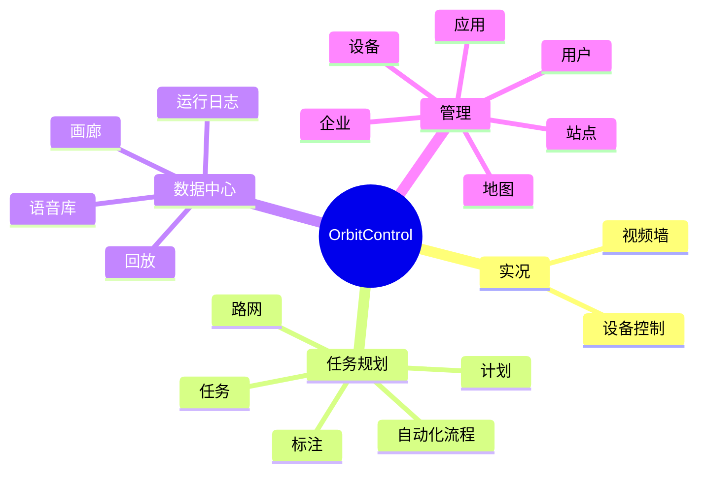
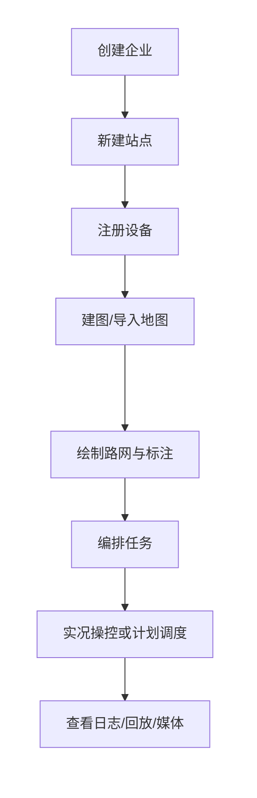

# 概述

本手册面向 OrbitControl 平台的**操作员**和**管理员**，按平台左侧导航的组织方式编排章节，你在系统里看到的每一个功能，都能在对应章节找到说明。

## 阅读建议

| 你的角色 | 建议阅读顺序 |
|----------|--------------|
| 新用户 | 快速开始 → 平台总览 → 角色与权限 |
| 操作员（日常操控设备） | 设备控制 → 视频墙 → 任务 → 运行日志 → 回放 |
| 管理员（配置和维护） | 站点管理 → 设备管理 → 地图管理 → 用户管理 → 企业管理 |

## 平台功能地图

## 典型工作流

一套完整的投入使用流程，通常按下面的顺序进行：

- **第 1~2 步**（管理员）：参见 [快速开始](./quick-start) 与 [站点管理](./sites)
- **第 3~5 步**（管理员）：参见 [设备管理](./devices)、[地图管理](./maps)、[路网](./route-graph)、[标注](./annotations)
- **第 6~7 步**（操作员）：参见 [任务](./missions)、[计划](./schedules)、[设备控制](./live-control)、[视频墙](./video-wall)
- **第 8 步**（操作员）：参见 [运行日志](./executions)、[画廊](./gallery)、[回放](./replay)
